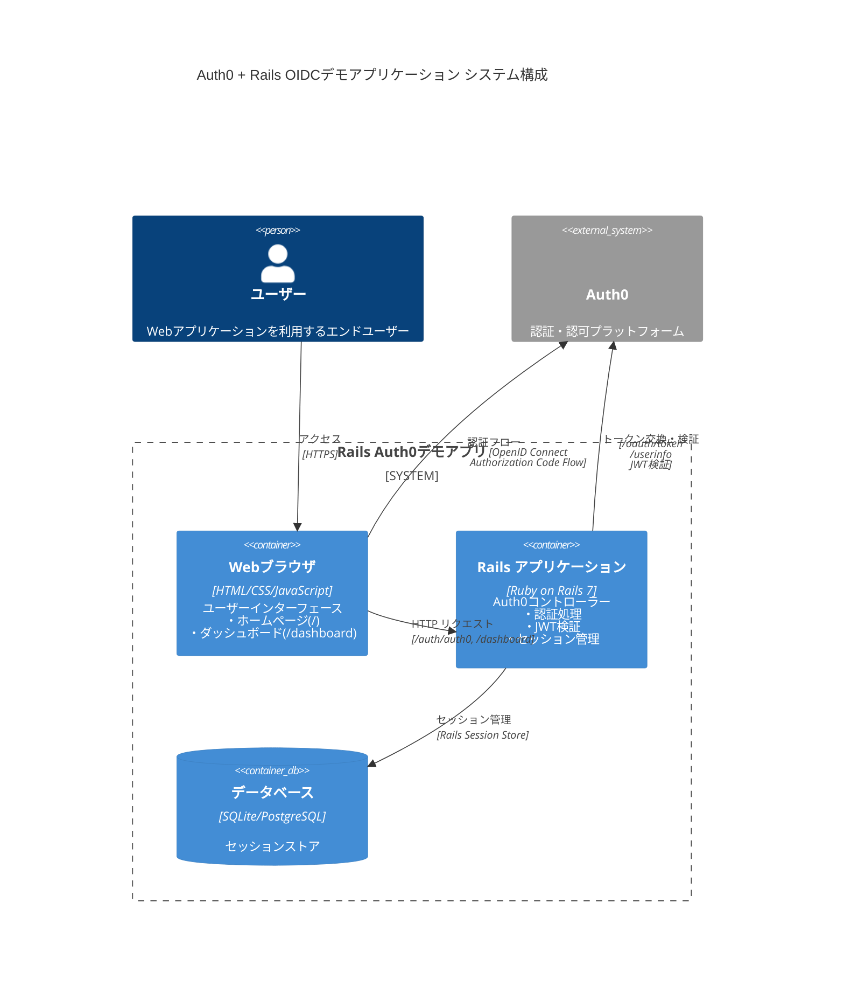
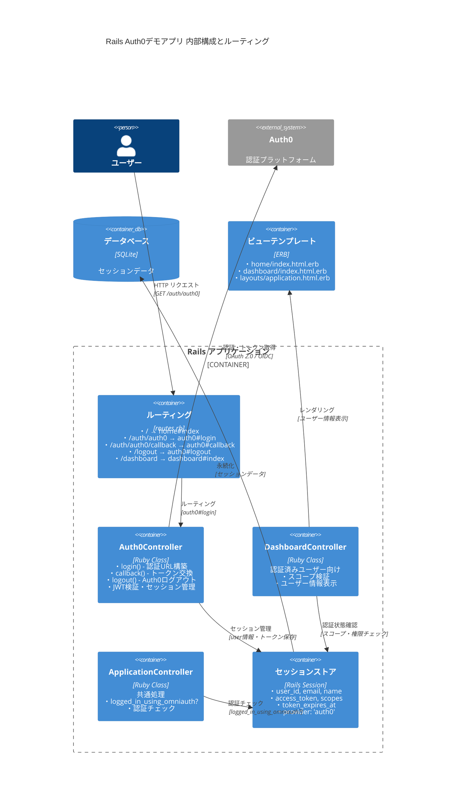
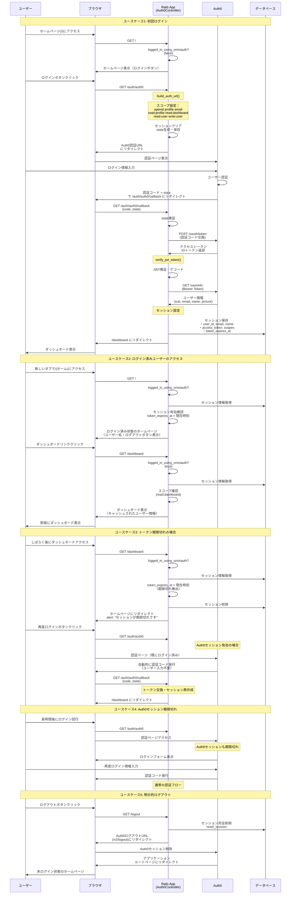
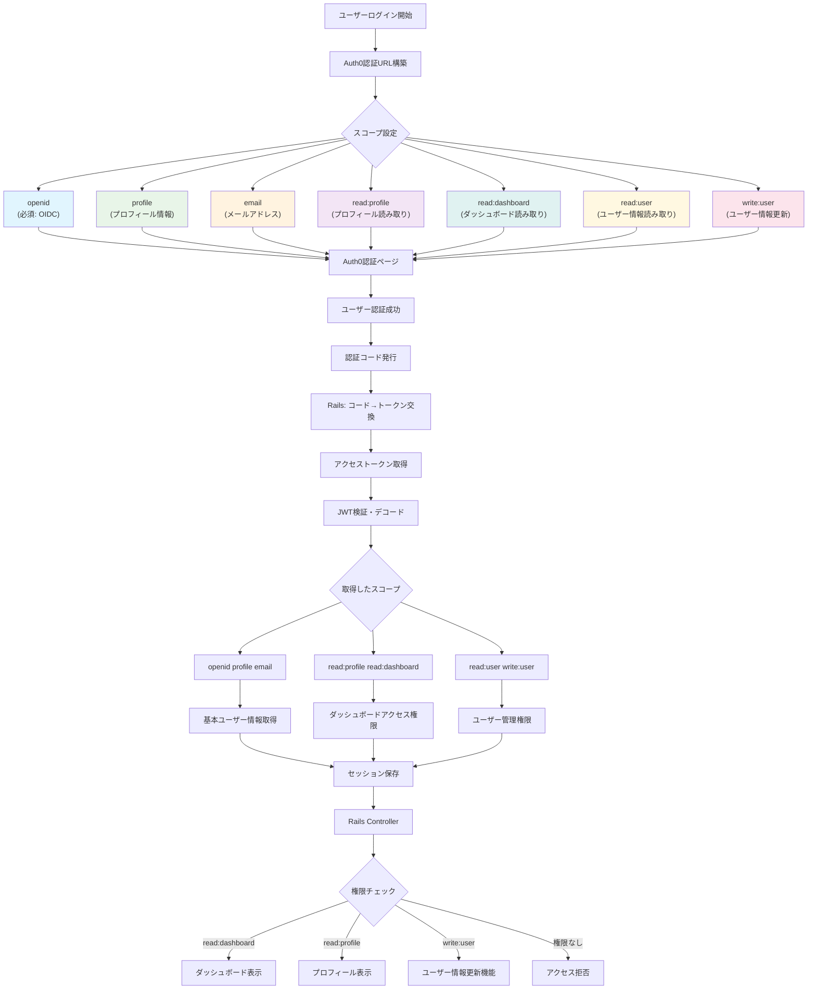

# Auth0 + Rails デモアプリケーション

Auth0でOpenID Connect (OIDC)のデモを行うRailsアプリケーションです。スコープベースの権限管理とRBACを実装しています。

## システム構成

### C4図: システム全体構成



### Rails内部構成



## 認証フロー

### 5つのユースケースシナリオ



### スコープと権限管理



## 技術仕様

### バージョン情報
- **Ruby**: 3.4.1
- **Rails**: 8.0.2
- **認証プロトコル**: OpenID Connect (OIDC) + OAuth 2.0
- **認証フロー**: Authorization Code Flow
- **トークン形式**: JWT (JSON Web Token)

### 主要機能
- Auth0を使用したOIDC認証
- スコープベースの権限管理
- セッション管理とトークン期限管理
- RBAC (Role-Based Access Control) 対応
- 自動ログアウト・再認証機能

## Auth0設定

### 1. Application設定

1. **Auth0ダッシュボード**にログイン
2. **Applications** → **Create Application**をクリック
3. 以下を設定：
   - **Name**: `Rails Auth0 Demo`
   - **Application Type**: `Regular Web Application`
   - **Technology**: `Ruby on Rails`

4. **Settings**タブで以下を設定：
   ```
   Allowed Callback URLs:
   http://localhost:3000/auth/auth0/callback

   Allowed Logout URLs:
   http://localhost:3000

   Allowed Web Origins:
   http://localhost:3000
   ```

5. **Client ID**, **Client Secret**, **Domain**をメモ

### 2. API設定（RBAC用）

1. **APIs** → **Create API**をクリック
2. 以下を設定：
   ```
   Name: Rails Auth0 Demo API
   Identifier: https://rails-auth0-demo.example.com
   Signing Algorithm: RS256
   ```

3. **Settings**で以下を有効化：
   ```
   ✅ Enable RBAC
   ✅ Add Permissions in the Access Token
   ```

4. **Permissions**タブで権限を追加：
   ```
   read:profile - プロフィール読み取り権限
   read:dashboard - ダッシュボード読み取り権限
   read:user - ユーザー情報読み取り権限
   write:user - ユーザー情報更新権限
   ```

### 3. Application にAPIを関連付け

1. **Applications** → 作成したApplication → **APIs**タブ
2. **Authorize** → 作成したAPIを選択
3. **Scopes** で必要な権限を選択

### 4. Role設定（RBAC）

1. **User Management** → **Roles** → **Create Role**
2. ロールを作成：
   ```
   Name: Dashboard User
   Description: ダッシュボードアクセス権限を持つユーザー
   ```

3. **Permissions**タブで権限を追加：
   - `read:profile`
   - `read:dashboard`
   - `read:user`

4. **Users**タブでユーザーにロールを割り当て

### 5. Test User作成

1. **User Management** → **Users** → **Create User**
2. テストユーザーを作成し、上記ロールを割り当て

## 環境構築

### 前提条件
- Ruby 3.4.1+
- Rails 8.0.2+
- Git

### セットアップ手順

1. **リポジトリクローン**
   ```bash
   git clone https://github.com/kyoneken/auth0_sample.git
   cd auth0_sample
   ```

2. **依存関係インストール**
   ```bash
   bundle install
   ```

3. **環境変数設定**
   
   `.env`ファイルを作成：
   ```bash
   touch .env
   ```
   
   以下の内容を追加：
   ```env
   AUTH0_DOMAIN=your-tenant.auth0.com
   AUTH0_CLIENT_ID=your_client_id
   AUTH0_CLIENT_SECRET=your_client_secret
   AUTH0_AUDIENCE=https://rails-auth0-demo.example.com
   ```

4. **データベース設定**
   ```bash
   rails db:create
   rails db:migrate
   ```

5. **サーバー起動**
   ```bash
   rails server
   ```

6. **アプリケーションアクセス**
   
   ブラウザで `http://localhost:3000` を開く

## 実行方法

### 基本的な使用フロー

1. **ホームページアクセス**
   - `http://localhost:3000` にアクセス
   - 未ログイン状態のページが表示

2. **ログイン**
   - 「Login with Auth0」ボタンをクリック
   - Auth0認証ページにリダイレクト
   - テストユーザーでログイン

3. **ダッシュボードアクセス**
   - ログイン成功後、自動的にダッシュボードへ
   - ユーザー情報とスコープ情報を確認

4. **ログアウト**
   - 「Logout」ボタンでログアウト
   - Auth0セッションも削除

### URL構成

| パス | 機能 | 認証要否 |
|------|------|----------|
| `/` | ホームページ | 不要 |
| `/auth/auth0` | Auth0ログイン開始 | 不要 |
| `/auth/auth0/callback` | Auth0コールバック | 自動 |
| `/dashboard` | ダッシュボード | 必要 |
| `/logout` | ログアウト | 必要 |

## トラブルシューティング

### よくある問題と解決方法

#### 1. 認証エラー

**症状**: `Invalid state parameter` エラー
```
解決方法:
1. ブラウザのキャッシュとCookieをクリア
2. Railsサーバーを再起動
3. セッションストアをクリア
```

**症状**: `No authorization code received` エラー
```
解決方法:
1. Auth0のCallback URLが正しく設定されているか確認
2. 環境変数が正しく設定されているか確認
```

#### 2. セッション関連の問題

**症状**: ログインしても認証状態が保持されない
```
解決方法:
1. セッションストアのクリア
2. ブラウザの再起動
3. Cookieの有効性確認
```

#### 3. スコープ・権限エラー

**症状**: `Access denied` エラー
```
解決方法:
1. Auth0でユーザーに適切なロールが割り当てられているか確認
2. APIのPermissions設定を確認
3. Applicationの認可設定を確認
```

### キャッシュ削除方法

#### Railsアプリケーション側
```bash
# セッションストアクリア
rails runner "Rails.cache.clear"

# 開発環境の一時ファイル削除
rails tmp:clear

# サーバー再起動
rails server
```

#### ブラウザ側
```
Chrome/Firefox:
1. 開発者ツール (F12) を開く
2. Application/Storage タブを選択
3. Cookies と Local Storage をクリア
4. または設定から「閲覧データを削除」

Safari:
1. 開発メニュー → 「キャッシュを空にする」
2. または環境設定 → プライバシー → 「Webサイトデータを管理」
```

#### Auth0セッション削除
```
1. Auth0ログアウトURLに直接アクセス：
   https://your-tenant.auth0.com/v2/logout

2. または /logout エンドポイントを使用
   http://localhost:3000/logout
```

### ログ確認方法

#### Rails開発ログ
```bash
# ログをリアルタイム監視
tail -f log/development.log

# Auth0関連のログのみ抽出
grep "Auth0" log/development.log
```

#### Auth0ダッシュボード
```
1. Auth0ダッシュボード → Monitoring → Logs
2. 直近の認証試行とエラーを確認
3. エラーの詳細情報を確認
```

### 環境変数チェック

```bash
# 環境変数が正しく読み込まれているか確認
rails console

# コンソール内で確認
ENV['AUTH0_DOMAIN']
ENV['AUTH0_CLIENT_ID']
ENV['AUTH0_CLIENT_SECRET']
ENV['AUTH0_AUDIENCE']
```

## コントリビューション

1. このリポジトリをフォーク
2. 機能ブランチを作成 (`git checkout -b feature/amazing-feature`)
3. 変更をコミット (`git commit -m 'Add amazing feature'`)
4. ブランチをプッシュ (`git push origin feature/amazing-feature`)
5. プルリクエストを作成

## ライセンス

このプロジェクトはMITライセンスの下で公開されています。詳細は `LICENSE` ファイルを参照してください。

## 参考資料

- [Auth0 Documentation](https://auth0.com/docs)
- [Rails Guides](https://guides.rubyonrails.org/)
- [OpenID Connect Specification](https://openid.net/connect/)
- [OAuth 2.0 RFC](https://tools.ietf.org/html/rfc6749)